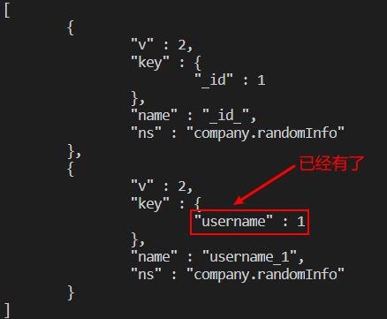
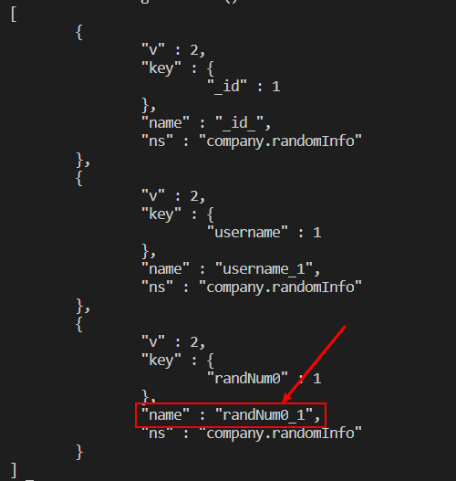

# mongodb笔记

## 1. 下载与安装

### 1. 1下载与安装

1. 进入mongodb官网，点击下载，如下图所示


### 1.2 安装重要过程

1. 选择complete就可以了，如下图所示

​            


2.  一定要取消这个图形化界面安装，如下图所示**（划重点）**

​                  


### 1.3 配制环境变量

1. 右键**我的电脑**，然后选择**属性**，接下来选择**环境变量**，如下图所示             

### 1.4 启动mongodb

1. 第一个窗口输入**mongod**启动数据库服务，第二个窗口输入**mongo**启动命令窗口，接下来就可以在第二个窗口输入命令             
2. 输入**use dbd** 表示切换到dbd数据库，如果没有这个数据库，则会自动创建然后再切换过去

## 2. 常用命令

| 命令                                                         | 解释                                                         |
| ------------------------------------------------------------ | ------------------------------------------------------------ |
| show dbs                                                     | 查看现有数据库，系统自带admin，local，config这三个           |
| db                                                           | 查看当前所在的数据库                                         |
| show collections                                             | 查看当前数据库有多少张**表**（也叫**集合**）                 |
| use dbd                                                      | 切换到**dbd**数据库，如果没有，则自动创建再切换过去          |
| db.user.insert({"name":"zhangsan"})                          | 在user表，并插入数据{"name":"zhangsan"}，如果没有这张表，自动创建，再插入数据 |
| db.user.find()                                               | 查看user表的所有数据                                         |
| db.user.update({"name":"zhangsan"},{"name":"zhangsan","age":18}) | 将user表中name为zhangsan的数据修改                           |
| db.user.remove({"name":"zhangsan"})                          | 将user表中name为zhangsan的数据删除                           |
| db.user.drop()                                               | 将user表删除                                                 |
| db.dropDatabase()                                            | 删除当前数据库                                               |

注意：这里的**db** 是内定的，不能修改

## 3. 插入数据

### 3.1 创建index.js文件

### 3.2 插入单条数据

1. 在index.js文件中编写如下代码

```javascript
// 1.连接dbd数据库
let dbd = connect('dbd');
// 2.往user表中插入一条数据
dbd.user.insert({ name: 'zhangsan' });
// 3. 查找user表中的数据
let res = dbd.user.find();
// 4. 使用forEach遍历查找结果
res.forEach((result) => printjson(result));
```

2. 输入**mongod**启动服务，在index.js同级目录中输入**mongo index.js** 运行代码

### 3.3 插入多条数据

``` javascript
// 1.连接dbd数据库
let dbd = connect('dbd');
// 2.在数据存入于数组中，然后直接插入数组
let items = [{"name":"xiaoming"},{"name":"xiaoli"}];
dbd.user.insert(items);
// 3. 查找user表中的数据
let res = dbd.user.find();
// 4. 使用forEach遍历查找结果
res.forEach((result) => printjson(result));
```

## 4. 查询数据

### 4.1 准备工作

``` javascript
let workmate1 = {
  name: 'JSPang',
  age: 33,
  sex: 1,
  job: '前端',
  skill: {
    skillOne: 'HTML+CSS',
    skillTwo: 'JavaScript',
    skillThree: 'PHP',
  },
  regeditTime: new Date(),
  interest: ['看电影', '看书', '吃美食', '钓鱼', '旅游'],
};

let workmate2 = {
  name: 'ShengLei',
  age: 31,
  sex: 1,
  job: 'JAVA后端',
  skill: {
    skillOne: 'HTML+CSS',
    skillTwo: 'J2EE',
    skillThree: 'PPT',
  },
  regeditTime: new Date(),
  interest: ['篮球', '看电影', '做饭'],
};

let workmate3 = {
  name: 'MinJie',
  age: 18,
  sex: 0,
  job: 'UI',
  skill: {
    skillOne: 'PhotoShop',
    skillTwo: 'UI',
    skillThree: 'PPT',
  },
  regeditTime: new Date(),
  interest: ['做饭', '画画', '看电影'],
};
let workmate4 = {
  name: 'XiaoWang',
  age: 25,
  sex: 1,
  job: 'UI',
  skill: {
    skillOne: 'PhotoShop',
    skillTwo: 'UI',
    skillThree: 'PPT',
  },
  regeditTime: new Date(),
  interest: ['写代码', '篮球', '画画'],
};
let workmate5 = {
  name: 'LiangPeng',
  age: 28,
  sex: 1,
  job: '前端',
  skill: {
    skillOne: 'HTML+CSS',
    skillTwo: 'JavaScript',
  },
  regeditTime: new Date(),
  interest: ['玩游戏', '写代码', '做饭'],
};

let workmate6 = {
  name: 'HouFei',
  age: 25,
  sex: 0,
  job: '前端',
  skill: {
    skillOne: 'HTML+CSS',
    skillTwo: 'JavaScript',
  },
  regeditTime: new Date(),
  interest: ['化妆', '读书', '做饭'],
};

let workmate7 = {
  name: 'LiuYan',
  age: 35,
  sex: 0,
  job: '美工',
  skill: {
    skillOne: 'PhotoShop',
    skillTwo: 'CAD',
  },
  regeditTime: new Date(),
  interest: ['画画', '聚会', '看电影'],
};

let workmate8 = {
  name: 'DingLu',
  age: 20,
  sex: 0,
  job: '美工',
  skill: {
    skillOne: 'PhotoShop',
    skillTwo: 'CAD',
  },
  regeditTime: new Date(),
  interest: ['美食', '看电影', '做饭'],
};

let workmate9 = {
  name: 'JiaPeng',
  age: 29,
  sex: 1,
  job: '前端',
  skill: {
    skillOne: 'HTML+CSS',
    skillTwo: 'JavaScript',
    skillThree: 'PHP',
  },
  regeditTime: new Date(),
  interest: ['写代码', '篮球', '游泳'],
};

let workmate10 = {
  name: 'LiJia',
  age: 26,
  sex: 0,
  job: '前端',
  skill: {
    skillOne: 'HTML+CSS',
    skillTwo: 'JavaScript',
    skillThree: 'PHP',
  },
  regeditTime: new Date(),
  interest: ['玩游戏', '美食', '篮球'],
};

let company = connect('company');
let workmateArray = [
  workmate1,
  workmate2,
  workmate3,
  workmate4,
  workmate5,
  workmate6,
  workmate7,
  workmate8,
  workmate9,
  workmate10,
];
company.workmate.insert(workmateArray);
print('[SUCCESS]：The data was inserted successfully');
```

### 4.2 简单查询

``` javascript
let company = connect('company');
// 1. 查找技术一为HTML+CSS的
let res = company.workmate.find({ 'skill.skillOne': 'HTML+CSS' });
// 2. 只显示姓名和技能一，其它不显示
// let res = company.workmate.find(
//   { 'skill.skillOne': 'HTML+CSS' },
//   { name: true, 'skill.skillOne': true, _id: false }
// );
// 3. forEach遍历输出
res.forEach((result) => printjson(result));
```

### 4.3 不等修饰符

- 小于($lt):英文全称less-than
- 小于等于($lte)：英文全称less-than-equal
- 大于($gt):英文全称greater-than
- 大于等于($gte):英文全称greater-than-equal
- 不等于($ne):英文全称not-equal 

``` javascript
let company = connect('company');

// 2. 只显示姓名和技能一，其它不显示
let res = company.workmate.find(
  { age: { $lte: 30, $gte: 25 } },
  { name: true, age: true, _id: false }
);
// 3. forEach遍历
res.forEach((result) => printjson(result));

```

### 4.4 多条件查询

``` javascript
// 1. 连接company数据库
let company = connect('company');

// 2. $in修饰符：年龄要么是25，要么是33
let res = company.workmate.find(
  { age: { $in: [25, 33] } },
  { name: true, age: true, _id: false }
);

// 3. forEach遍历
res.forEach((result) => printjson(result));

```

``` javascript
// 2. $or修饰符：会php或年龄大于等于30岁
let res = company.workmate.find(
  { $or: [{ age: { $gte: 30 } }, { 'skill.skillThree': 'PHP' }] },
  { name: true, age: true, 'skill.skillThree': true, _id: false }
);
```

``` javascript
// 2. $and修饰符：年龄大于等于30岁且会php
let res = company.workmate.find(
  { $and: [{ age: { $gte: 30 } }, { 'skill.skillThree': 'PHP' }] },
  { name: true, 'skill.skillThree': true, age: true, _id: false }
);
```

``` javascript
// 2. $not修饰符：除什么以外
let res = company.workmate.find(
  {
    age: {
      $not: {
        $lte: 30,
        $gte: 20,
      },
    },
  },
  { name: true, age: true, 'skill.skillThree': true, _id: false }
);
```

### 4.5 数组查询

``` javascript
// 2. 查找爱好是画画、聚会、看电影
let res = company.workmate.find(
  { interest: ['画画', '聚会', '看电影'] },
  { name: true, interest: true, age: true, _id: false }
);
```

``` javascript
// 2. $all修饰符：同时喜欢看书和看电影
let res = company.workmate.find(
  { interest: { $all: ['看电影', '看书'] } },
  { name: true, interest: true, age: true, _id: false }
);
```

``` javascript
// 2. $in修饰符：爱好属于看书、看电影
let res = company.workmate.find(
  { interest: { $in: ['看电影', '看书'] } },
  { name: true, interest: true, age: true, _id: false }
);
```

``` javascript
// 2. $size修饰符：爱好有5个
let res = company.workmate.find(
  { interest: { $size: 5 } },
  { name: true, interest: true, age: true, _id: false }
);
```

``` javascript
// 2. { $slice: 2 }显示前两项，负数表示后几项
let res = company.workmate.find(
  {},
  { name: 1, interest: { $slice: 2 }, age: 1, _id: 0 }
);
```

### 4.6 分页

find参数：

- query：这个就是查询条件，MongoDB默认的第一个参数。
- fields：（返回内容）查询出来后显示的结果样式，可以用true和false控制是否显示。
- limit：返回的数量，后边跟数字，控制每次查询返回的结果数量。
- skip:跳过多少个显示，和limit结合可以实现分页。
- sort：排序方式，从小到大排序使用1，从大到小排序使用-1。

``` javascript
// 跳过前3条后显示两条数据，也就是说只显示第4,5条数据
let res = company.workmate
  .find({}, { name: true, age: true, _id: false })
  .skip(3)
  .limit(2);
```

``` javascript
// 跳过前两条后，显示全部，但按年龄由小到大排序
// limit(0)表示显示全部
let res = company.workmate
  .find({}, { name: true, age: true, _id: false })
  .limit(0)
  .skip(2)
  .sort({ age: 1 });
```

### 4.7 遍历数组

``` javascript
let company = connect('company');
let result = company.workmate.find();
//利用游标的hasNext()进行循环输出结果。
while (result.hasNext()) {
  printjson(result.next()); //用json格式打印结果
}
```


## 5. 更新数据update

**findAndModify属性值：**

- query：需要查询的条件/文档
- sort: 进行排序
- remove：[boolean]是否删除查找到的文档，值填写true，可以删除。
- update：更新条件，update与remove只能存在一个
- new:[boolean]返回更新前的文档还是更新后的文档。
- fields：需要返回的字段
- upsert：没有这个值是否增加。

### 5.1 update修改器

#### 1. 简单修改

``` java
// 1. 连接company数据库
let company = connect('company');

// 2.创建对象
let myModify = {
  // 2.1 表名
  findAndModify: 'workmate',
  // 2.2 查询条件
  query: { name: 'JSPang' },
  // 2.3 更新条件
  update: { $set: { age: 18 } },
  // 2.4 返回更新后的结果，false表示返回更新前的结果
  new: true,
};
// 执行对象
let ResultMessage = company.runCommand(myModify);

// 输入返回的结果
printjson(ResultMessage);
```

如果返回的对象的**updatedExisting**的值为**true**，证明更新成功，如下图所示

``` javascript
{
        "lastErrorObject" : {
                "n" : 1,
                "updatedExisting" : true
        },
        "value" : {
                "_id" : ObjectId("5ed51b0ca37ac7c7d5edf27f"),
                "name" : "JSPang",
                "age" : 18,
                "sex" : 1,
                "job" : "前端",
                "skill" : {
                        "skillOne" : "HTML+CSS",
                        "skillTwo" : "JavaScript",
                        "skillThree" : "PHP"
                },
                "regeditTime" : ISODate("2020-06-01T15:13:16.753Z"),
                "interest" : [
                        "看电影",
                        "看书",
                        "吃美食",
                        "钓鱼",
                        "旅游"
                ]
        },
        "ok" : 1
}
```

#### 2.  $set修改器

$set修改器用来修改数据，如下图所示

``` javascript
let company = connect('company');

let myModify = {
  findAndModify: 'workmate',
  // 查找MinJie
  query: { name: 'MinJie' },
  // 更新sex和age和skillThree
  update: { $set: { sex: 2, age: 21, 'skill.skillThree': 'word' } },
  new: true,
};

let ResultMessage = company.runCommand(myModify);

printjson(ResultMessage);

```

#### 3. $unset修改器

$unset修改器用来删除属性，如年龄，删除之后可以使用$set加回来

``` javascript
let company = connect('company');

let myModify = {
  findAndModify: 'workmate',
  // 查找MinJie
  query: { name: 'MinJie' },
  // 删除年龄
  update: { $unset: { age: '' } },
  new: true,
};

let ResultMessage = company.runCommand(myModify);

printjson(ResultMessage);

```

#### 4. $inc对数字进行计算

$inc修改的值必须是数字，字符串是不起作用的

``` javascript
let company = connect('company');

let myModify = {
  findAndModify: 'workmate',
  // 查找MinJie
  query: { name: 'MinJie' },
  // 年龄减2岁
  update: { $inc: { age: -2 } },
  new: true,
};

let ResultMessage = company.runCommand(myModify);

printjson(ResultMessage);

```

#### 5. upsert用法

``` javascript

let company = connect('company');

let myModify = {
  findAndModify: 'workmate',
  query: { name: 'xiaoWang' },
  update: { $set: { interest: [] } },
  // 如果不存在，则自动添加
  upsert: true,
  new: true,
};

let ResultMessage = company.runCommand(myModify);

printjson(ResultMessage);

```

### 5.2 update数组修改器

#### 1. $push追加数据

``` javascript
let company = connect('company');

let myModify = {
  findAndModify: 'workmate',
  query: { name: 'xiaowang' },
  // 往数组interset里面添加数据
  update: { $push: { interest: 'draw' } },
  // 如果不存在，则自动添加
  upsert: true,
  new: true,
};

let ResultMessage = company.runCommand(myModify);

printjson(ResultMessage);

```

#### 2. $addToSet

$addToSet没有则添加，有则不添加

``` javascript
let company = connect('company');

let myModify = {
  findAndModify: 'workmate',
  query: { name: 'xiaowang' },
  // 没有读书的爱好，则添加
  update: { $addToSet: { interest: 'readBook' } },
  // 如果不存在，则自动添加
  upsert: true,
  new: true,
};

let ResultMessage = company.runCommand(myModify);

printjson(ResultMessage);

```

#### 3. $each

```javascript
let company = connect('company');
let newInterset = ['Sing', 'Dance', 'Code'];
let myModify = {
  findAndModify: 'workmate',
  query: { name: 'xiaowang' },
  // $each:添加多条数据
  update: { $addToSet: { interest: { $each: newInterset } } },
  // 如果不存在，则自动添加
  upsert: true,
  new: true,
};

let ResultMessage = company.runCommand(myModify);

printjson(ResultMessage);

```

#### 4. $pop

``` javascript
let company = connect('company');
let myModify = {
  findAndModify: 'workmate',
  query: { name: 'xiaowang' },
  // $pop只能取值1或-1，删除最后一条或第一条数据
  update: { $pop: { interest: 1 } },
  upsert: true,
  new: true,
};

let ResultMessage = company.runCommand(myModify);

printjson(ResultMessage);

```

#### 5. 数组定位

``` javascript
let company = connect('company');
let myModify = {
  findAndModify: 'workmate',
  query: { name: 'xiaowang' },
  // $set中interset.1表示修改第二个爱好
  update: { $set: { 'interest.1': 'code' } },
  upsert: true,
  new: true,
};
let ResultMessage = company.runCommand(myModify);

printjson(ResultMessage);
```


## 6. 索引

### 6.1 创建百万数据

``` javascript
//生成随机数

function GetRandomNum(min, max) {
  let range = max - min; //得到随机数区间
  let rand = Math.random(); //得到随机值
  return min + Math.round(rand * range); //最小值+随机数取整
}

//console.log(GetRandomNum(10000,99999));

//生成随机用户名
function GetRadomUserName(min, max) {
  let tempStringArray = '123456789qwertyuiopasdfghjklzxcvbnm'.split(''); //构造生成时的字母库数组
  let outPuttext = ''; //最后输出的变量
  //进行循环，随机生产用户名的长度，这里需要生成随机数方法的配合
  for (let i = 1; i < GetRandomNum(min, max); i++) {
    //随机抽取字母，拼装成需要的用户名
    outPuttext =
      outPuttext + tempStringArray[GetRandomNum(0, tempStringArray.length)];
  }
  return outPuttext;
}

// console.log(GetRadomUserName(7,16))
// var startTime=(new Date()).getTime();
let company = connect('company');
// company.randomInfo.drop();
let tempInfo = [];
for (let i = 0; i < 2000000; i++) {
  tempInfo.push({
    username: GetRadomUserName(7, 16),
    regeditTime: new Date(),
    randNum0: GetRandomNum(100000, 999999),
    randNum1: GetRandomNum(100000, 999999),
    randNum2: GetRandomNum(100000, 999999),
    randNum3: GetRandomNum(100000, 999999),
    randNum4: GetRandomNum(100000, 999999),
    randNum5: GetRandomNum(100000, 999999),
    randNum6: GetRandomNum(100000, 999999),
    randNum7: GetRandomNum(100000, 999999),
    randNum8: GetRandomNum(100000, 999999),
    randNum8: GetRandomNum(100000, 999999),
  });
}

company.randomInfo.insert(tempInfo);

```


### 6.2 创建索引

``` javascript
// 1. 连接数据库
let company = connect('company');
// 2. 为username创建索引 username: 1固定写法
company.randomInfo.ensureIndex({ username: 1 });
// 3. 查看索引
let result = company.randomInfo.getIndexes();
printjson(result);

```

3. 终端的情况如下图所示：



4. **创建索引**前后运行的时间，如下图所示

``` javascript
// 记录程序运行时间
let startTime = new Date().getTime();
// 连接数据库
let company = connect('company');
// 根据用户名查找
let rs = company.randomInfo.find({ username: 'tfruhjy8k' });
// 循环输出
rs.forEach((rs) => {
  printjson(rs);
});
// 得到程序运行时间
let runTime = new Date().getTime() - startTime;
// 打印出运行时间
print('[SUCCESS]This run time is:' + runTime + 'ms');

```

### 6.3 复合索引

1. 复合索引是指两条以上的索引，接下来为**randNum0**创建一个索引，所以现在有两条索引了：**username**和**randNum0**

``` javascript
// 1. 连接数据库
let company = connect('company');
// 2. 为randNum0创建索引
company.randomInfo.ensureIndex({ 'randNum0': 1 });
// 3. 查看索引
let result = company.randomInfo.getIndexes();
printjson(result);

```

2. 指定索引查询，因为**数字的索引比字符串的索引快**，如下图所示

``` javascript
let startTime = new Date().getTime();
let company = connect('company');
// hint({randNum0:1})表示优先使用randNum0索引
let rs = company.randomInfo
  .find({ username: '7xwb8y3', randNum0: 565509 })
  .hint({ randNum0: 1 });
rs.forEach((rs) => {
  printjson(rs);
});
let runTime = new Date().getTime() - startTime;

print('[SUCCESS]This run time is:' + runTime + 'ms');

```

### 6.4 删除索引

``` javascript
let startTime = new Date().getTime();
let company = connect('company');
// 删除索引
company.randomInfo.dropIndex('randNum0_1');
// 查看索引
let result = company.randomInfo.getIndexes();
printjson(result);

```

上面的**randNum0_1**指的是**name**值，不要写错了，如下图所示



### 6.5 全文索引


### 6.6 总结

总结了几条不用索引的情况（不一定对，但是自己的经验之谈）。

- 数据不超万条时，不需要使用索引。性能的提升并不明显，而大大增加了内存和硬盘的消耗。
- 查询数据超过表数据量30%时，不要使用索引字段查询。实际证明会比不使用索引更慢，因为它大量检索了索引表和我们原表。
- 数字索引，要比字符串索引快的多，在百万级甚至千万级数据量面前，使用数字索引是个明确的选择。
- 把你经常查询的数据做成一个内嵌数据（对象型的数据），然后集体进行索引。


